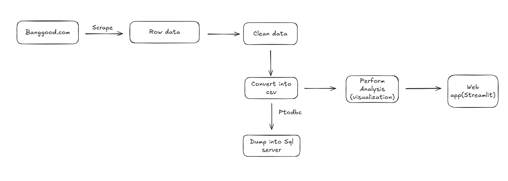

# Banggood Product Data Engineering Pipeline

## ** Project Overview **
This project implements an End-to-End Data Engineering pipeline to scrape, clean, store, and analyze product data from Banggood.com. It focuses on 5 major e-commerce categories, extracting insights on pricing strategies, customer reviews, and revenue potential.

Objective: Automate the process of gathering competitive intelligence data for a startup.

 ## **Tech Stack & Tools**

- Selenium, Python

- pandas, NumPy

- SQL Server, pyodbc

- SQL, Matplotlib, Seaborn

- Streamlit

## **Dataset Architecture**

The project handles data for the following 5 categories:

Sports & Outdoor

Electronics

Men & Women Clothing

Computer & Video Games

Automobiles & Motorcycles

Schema (SQL Table Structure):

Product_ID (PK, Int)

Name (Varchar)

Price (Float)

Reviews (Int)

URL (Varchar)

Price_Segment (Varchar) - Derived Feature

Est_Revenue (Float) - Derived Feature

Loaded_Date (DateTime)

## **Key Insights & Analysis**

The project answers critical business questions using SQL & Python:

Pricing Strategy: What is the average price point for "Premium" vs "Budget" items?

Popularity: Which products have the highest review counts?

Revenue Drivers: Which categories generate the most estimated revenue?

Stock Analysis: Percentage of items currently available/in-stock.

## **Author**

[Hafiz Muhammad Waqas] Data Engineering Enthusiast[https://www.linkedin.com/in/muhammad-waqas-b1a591230/] | [https://github.com/waqasowais12]