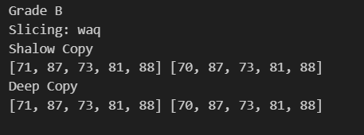

## THis repo include practice questions for increasing a logic building

### Topics include :

- String
- Slicing
- Concatinating string
- Operators
- Conditional statements
- List
- Tuples
- Set
- Deep & Shalow copy

### Questions: 1

### 1. Student Report Card Generator

#### Concepts Covered: Strings, concatenation, conditional statements, lists, tuples, sets, slicing, operators, deep vs shallow copy.

##### 👉 Problem Statement:
##### You are developing a Student Report Card System for a school.

- Take student details (Name, Roll No) as a string.

- Store marks of 5 subjects inside a list.

- If marks are less than 40, print "Fail", otherwise "Pass".

- Use comparison operators to calculate total, percentage, and grade (A, B, C, Fail).

- Keep record of unique subjects in a set (no duplicates allowed).

- Store the student info (name, roll) inside a tuple (since it should not change).

- Use slicing to print only the first 3 characters of student’s name.

- Demonstrate deep vs shallow copy when copying the marks list (change marks in shallow copy and see effect).

Ouput Question 1: 

