## DICTIONARY & iT'S METHODS

### 1. DIctionary method fromkeys()
- It recieves values from list as keys of dictionary. eg. --> d = dict.fromkeys(keys)
- It set values of keys as none you can assign generic value for all the keys values. eg. --> d = dict.fromkeys(keys, 0)

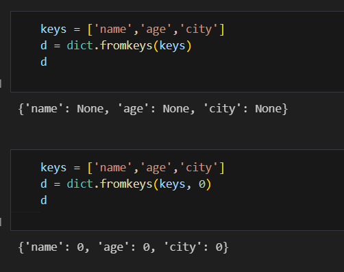

### 2. Dictionary method get()

- It returns the value of given key if the key is in the dictionary. eg. --> dic.get("city") --> karachi
- If the key does not exist, instead of throwing an error, it returns None

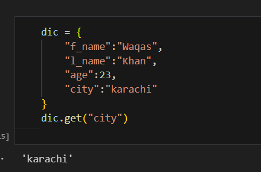

### 3. Dictionary method items()

- It return whole dictionary keys and values as a sequence of tuple. 

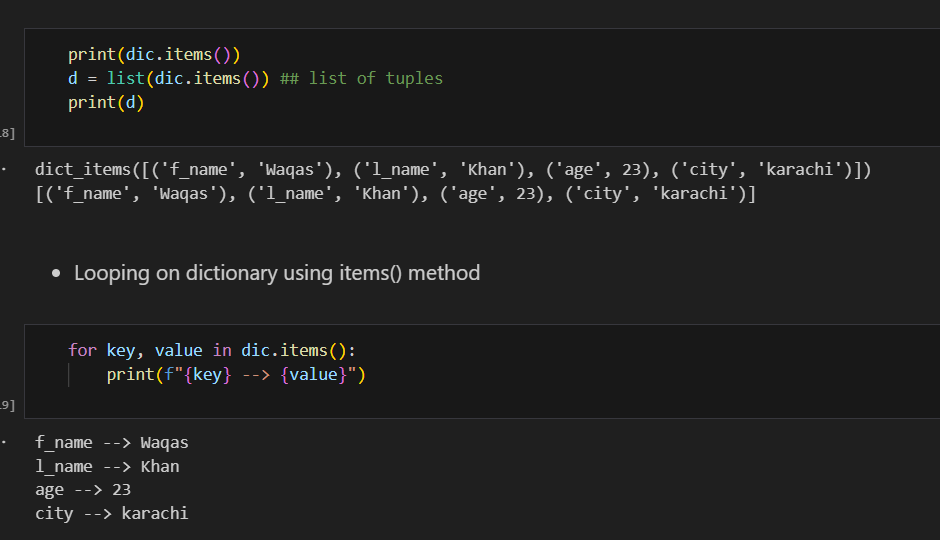

### 4. Dictionary method keys()

- It return all the keys of the dictionary without values.

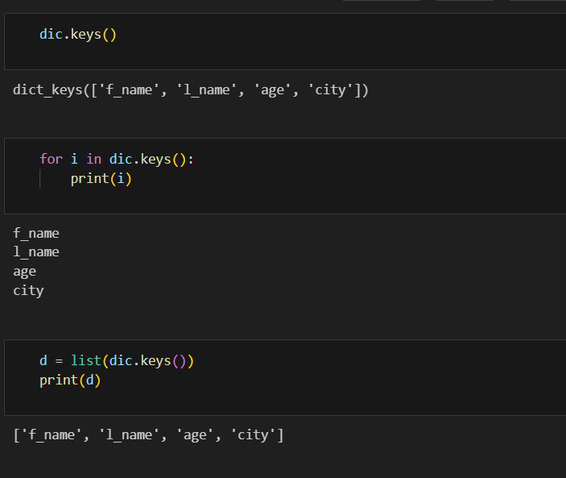

### 5. Dictionary method pop()

- The pop() method removes a key from the dictionary and returns its value.
- default (optional) → value to return if the key is not found (instead of throwing an error). dic.pop(key, default)

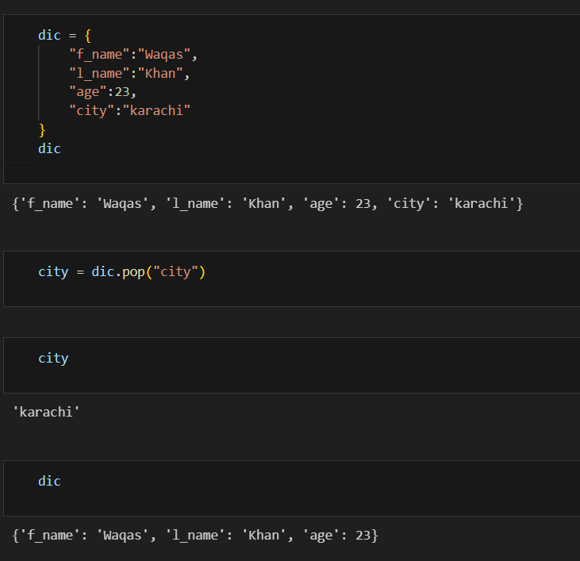

### 6. Dictionary method popitem()

- The popitem() method removes and returns the last inserted key-value pair from the dictionary as a tuple (key, value).

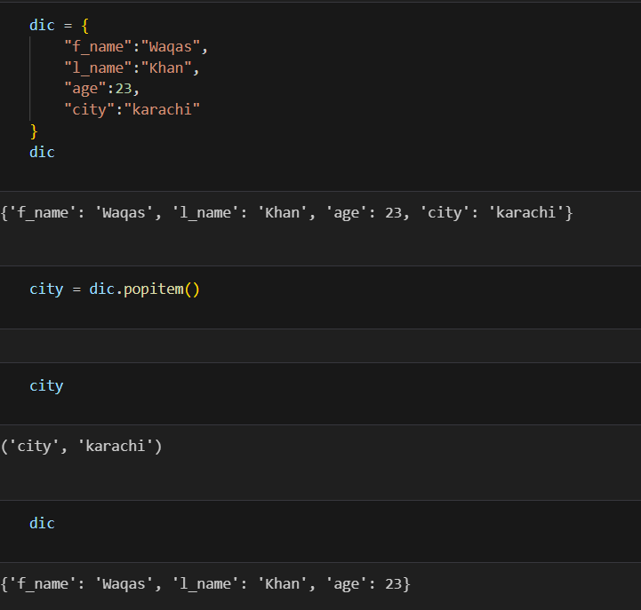

### 7. Dictionary method setdefault()

- Return the value of a key if it exists in the dictionary.

- If the key does not exist, it inserts the key with a default value and then returns that default value.

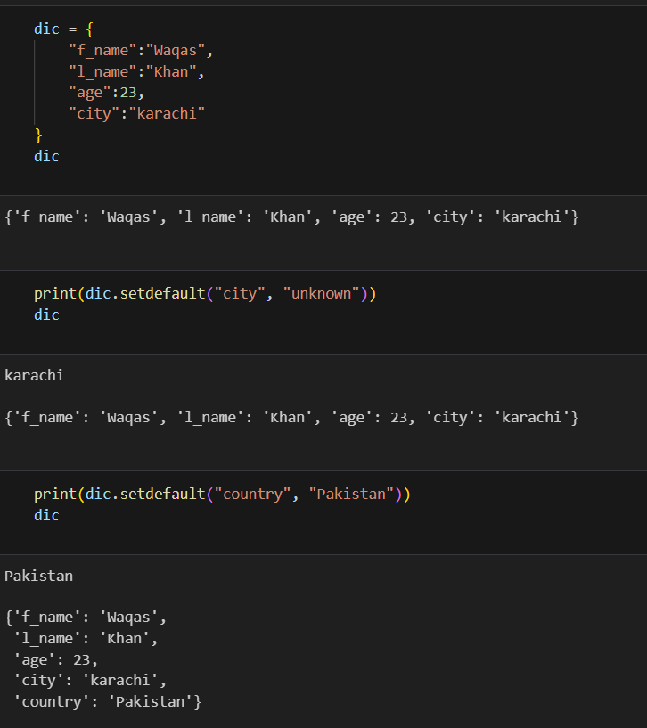

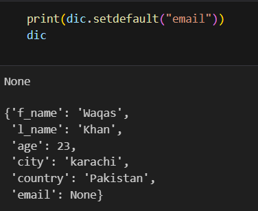

### 8. Dictionary method update()

- The update() method is used to merge another dictionary (or key-value pairs) into the current dictionary.
    - If a key already exists → its value is updated/overwritten.
    - If a key doesn’t exist → it is added.

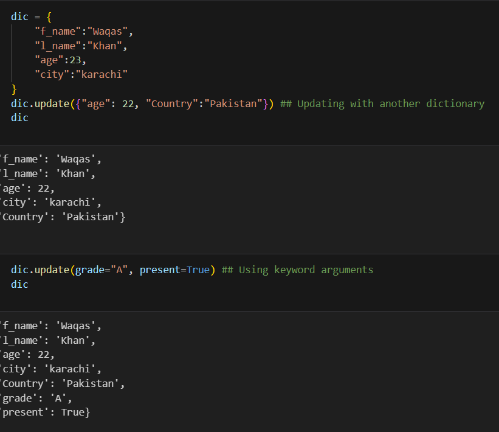

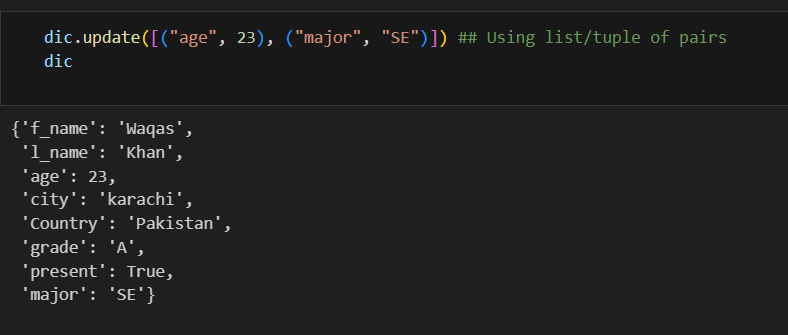

### 9. Dictionary method values

- It return all the values of dictionary without keys.

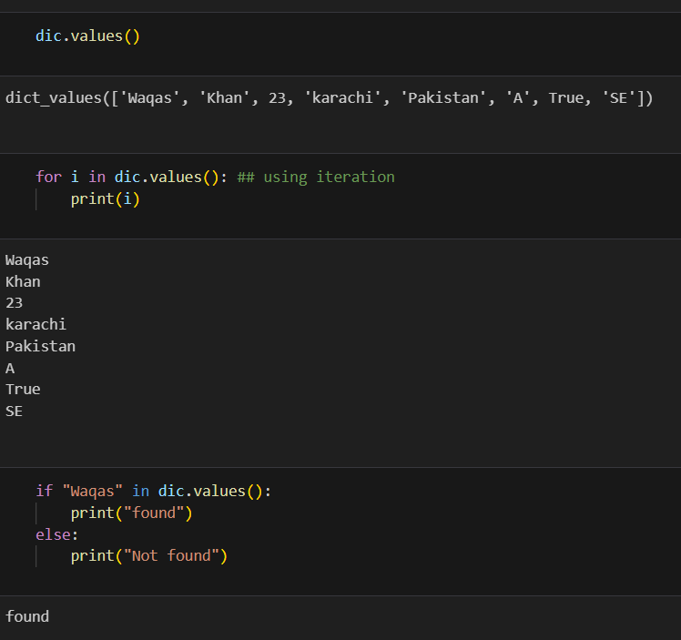

### 10. Dictionary method copy()

- The copy() method creates a shallow copy of the dictionary.
- That means it makes a new dictionary with the same key–value pairs, but it does not deeply copy nested objects.

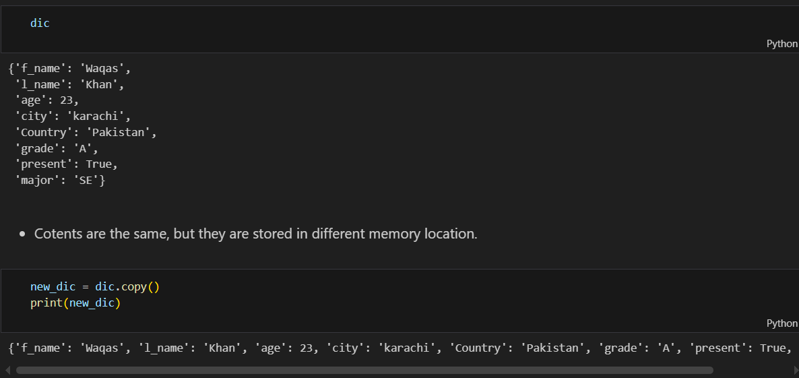

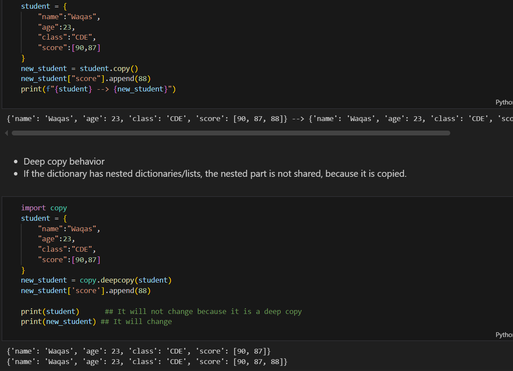

### 11. Dictionary method clear()

- The clear() method removes all key–value pairs from a dictionary, leaving it completely empty.
- clear() modifies the dictionary in place.
- If other variables reference the same dictionary, they will also see it empty after clear().

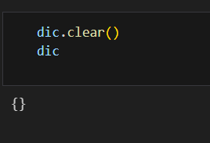