## STRING & IT'S METHODS

#                                                REMEMBER:
###             All the functions we apply on a string, It does not change the original string it returns a new                                       string with the changes we did
###                                        Beacause strings are Immutable

### 1. String fucntion len()

- This function returns the len of string

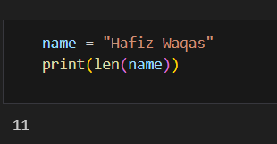

### 2. String function endswith()

- string.endswith("qas") - This function_tells whether the variable string ends with the string "qas" or not.If string is "waqas", it returns true for "rry" since waqas ends with qas.

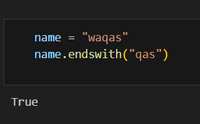

### 3. String function startswith()

- string.startswith("wa") - This function_tells whether the variable string starts with the string "wa" or not.If string is "waqas", it returns true for "wa" since waqas starts with wa.

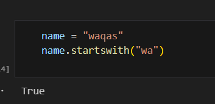

### 4. String function count()

- string.count("a") - counts the total number of occurance of any character.

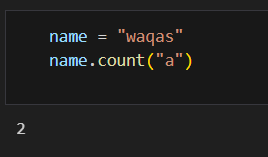

### 5. String function capatalize()

- Transform the first word of string into capital letter.

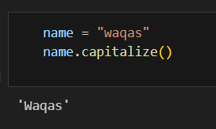

### 6. String function upper()

- Changes the whole string into upper case.

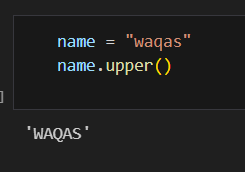

### 7. String function lower()

- Changes the whole string into lower case.

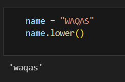

### 8. String function casefold()

- Remaining (see later)

### 9. String function center()

- Remaining (see later)

### 10. String function find()

- returns the first occurance index of given value in a string.
- If the given value is not in the string it simply return -1.

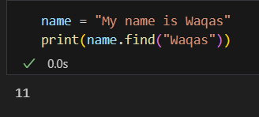

### 11. String function replace()

- It replaces the value we set against the given value.

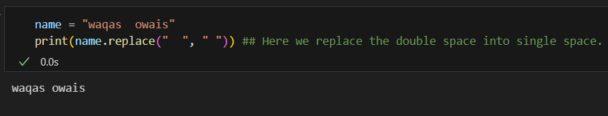

### 12. String function swapcase()

- Swap case (upper ---> lower, lower ---> upper)

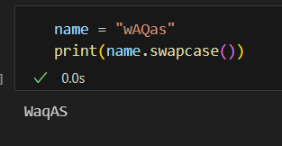

### 13. String function isalpha()

- isalpha() returns True if all letters otherwise it returns false.

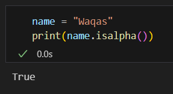

### 14. String function isdigit()

- isdigit() returns True if all are digit otherwise it returns false.

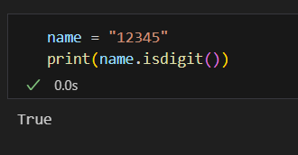

### 15. String function isalnum()

- isalnum() returns True if string has leeter+digit otherwise it returns false.

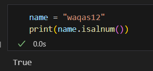

### 16. String function isspace()

- isspace() returns True if there only space in an string otherwise returns false().

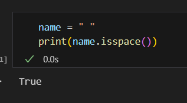

### 17. String function find(substring) 

- Finds the index of first occurrence (returns -1 if not found).

.png)

### 18. String function join(iterable)

- Joins list elements into a single string.

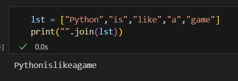

### 19. String function split()

- Splits string into a list based on separator.

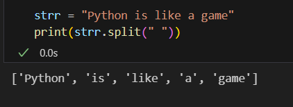

### 20. String function strip()

- Splits string into a list based on separator.

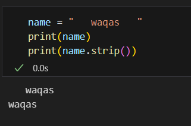

### 21. String function title()

- Capitalizes the first letter of each word.

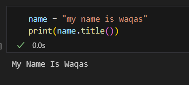