## CONDITIONAL STATEMENT ASSIGNEMNT

### Q1. A company decided to give bonus of 5% to employee if his/her year of service is more than 5 years. Ask user for their salary and year of service and print the net bonus amount.

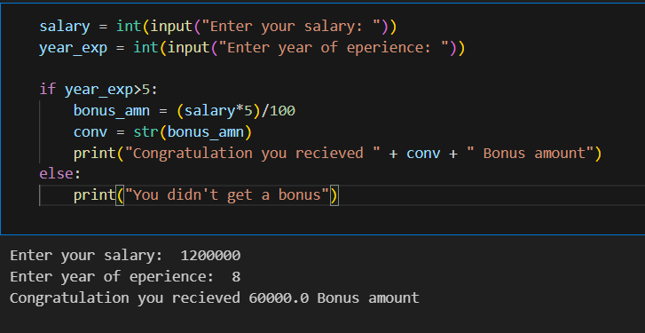

### Q2. Write a program to check whether a person is eligible for voting or not. (accept age from user) if age is greater than 17 eligible otherwise not eligible

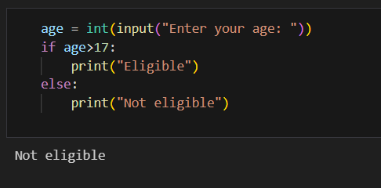

### Q3.  Write a program to check whether a number entered by user is even or odd.

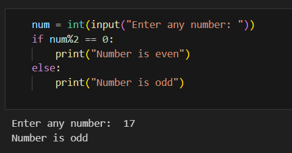

### Q4. Write a program to check whether a number is divisible by 7 or not. Show Answer

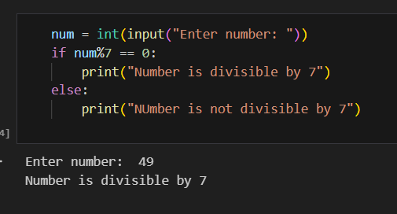

### Q5. Write a program to display "Hello" if a number entered by user is a multiple of five , otherwise print "Bye".

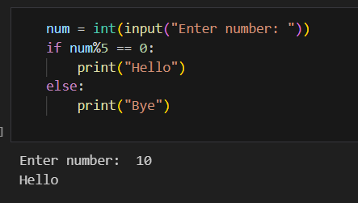

### Q6. Write a program to display the last digit of a number.

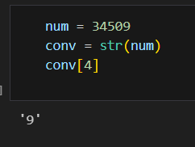

### Q7. Take values of length and breadth of a rectangle from user and print if it is square or rectangle.

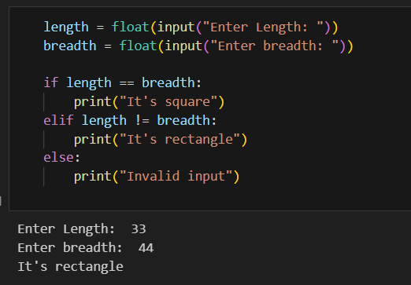

### Q8. Take two int values from user and print greatest among them.

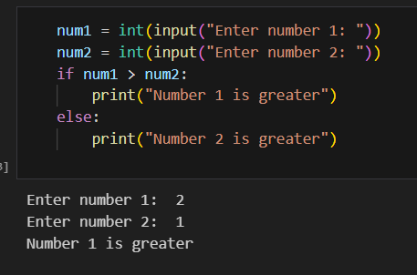

### Q9. A shop will give discount of 10% if the cost of purchased quantity is more than 1000. Ask user for quantity Suppose, one unit will cost 100. Judge and print total cost for user.

.png.png)

.png.png)

### Q10.  A school has following rules for grading system:

- a. Below 25 - F

- b. 25 to 45 - E

- c. 45 to 50 - D

- d. 50 to 60 - C

- e. 60 to 80 - B

- f. Above 80 - A

- Ask user to enter marks and print the corresponding grade.

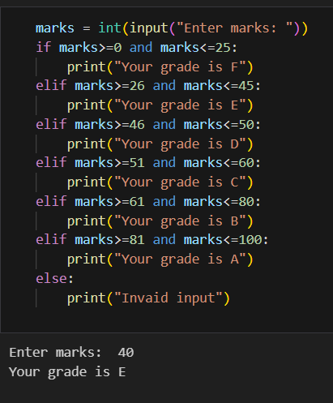

### Q11. A student will not be allowed to sit in exam if his/her attendence is less than 75%.

- Take following input from user

- Number of classes held

- Number of classes attended.

- And print

- percentage of class attended

- Is student is allowed to sit in exam or not.

### Q12. Modify the above question to allow student to sit if he/she has medical cause. Ask user if he/she has medical cause or not ( 'Y' or 'N' ) and print accordingly.

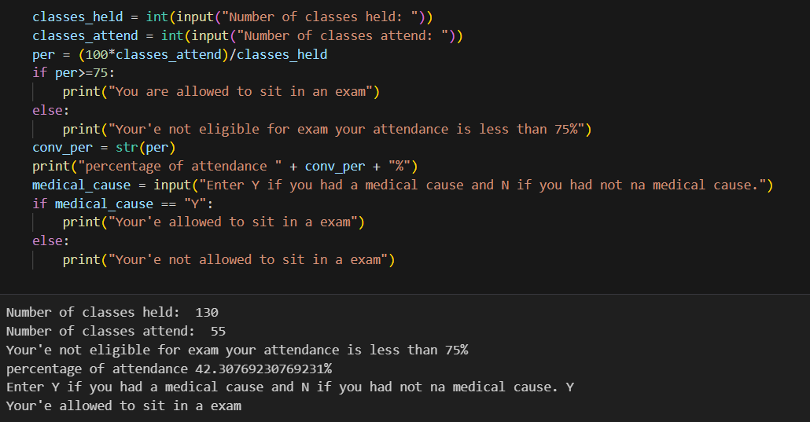

### Q13. Write a program to check if a year is leap year or not. If a year is divisible by 4 then it is leap year but if the year is century year like 2000, 1900, 2100 then it must be divisible by 400.

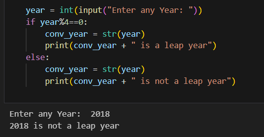

### Q14. Ask user to enter age, gender ( M or F ), marital status ( Y or N ) and then using following rules print their place of service.

- if employee is female, then she will work only in urban areas.

- if employee is a male and age is in between 20 to 40 then he may work in anywhere

- if employee is male and age is in between 40 t0 60 then he will work in urban areas only.

- And any other input of age should print "ERROR"

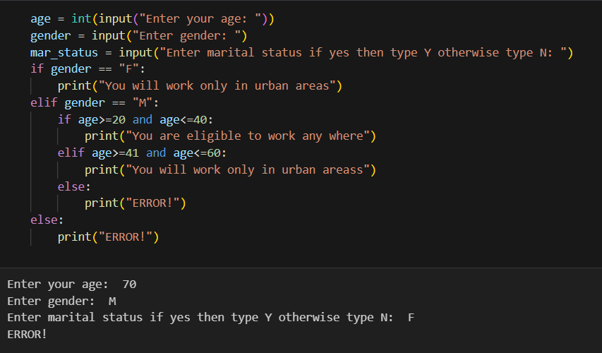

### Q15. Write a program to calculate the electricity bill (accept number of unit from user) according to the following criteria : Unit Price uptp 100 units no charge Next 200 units Rs 5 per unit After 200 units Rs 10 per unit (For example if input unit is 350 than total bill amount is Rs.3500 (For example if input unit is 97 than total bill amount is Rs.0 (For example if input unit is 150 than total bill amount is Rs.750

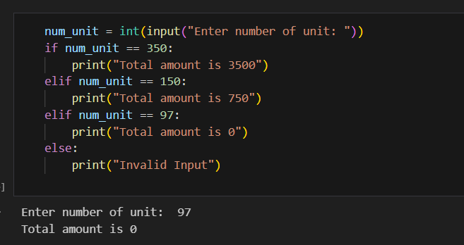

### Q16. Take input of age of 3 people by user and determine oldest and youngest among them.

