## LIST ASSIGNMENT

### Q1.  Write a program that accepts a list from user and print the alternate element of list.

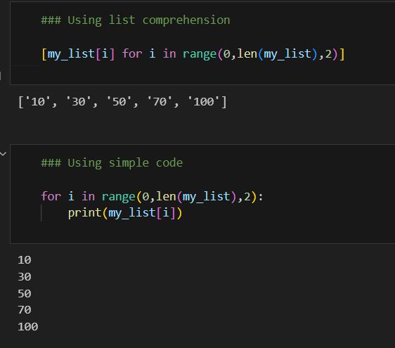

### Q2. Write a program that accepts a list from user. Your program should reverse the content of list and display it. Do not use reverse() method. 

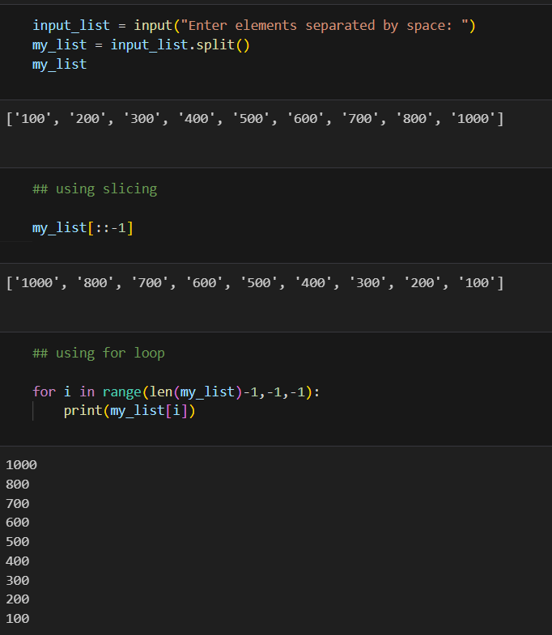

### Q3.  Find and display the largest number of a list without using built-in function max(). Your program should ask the user to input values in list from keyboard. 

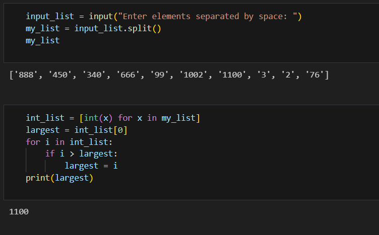

### Q4. Write a program that rotates the element of a list so that the element at the first index moves to the second index, the element in the second index moves to the third index, etc., and the element in the last index moves to the first index.

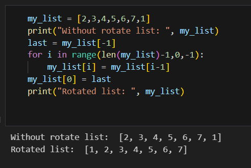

### Q5.  Write a program that input a string and ask user to delete a given word from a string.  

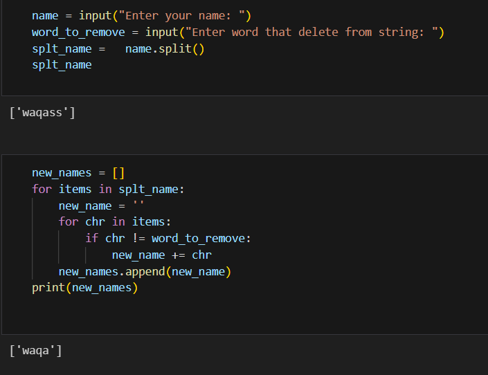

### Q6.  Write a program that reads a string from the user containing a date in the form mm/dd/yyyy. It should print the date in the form March 12, 2021. 

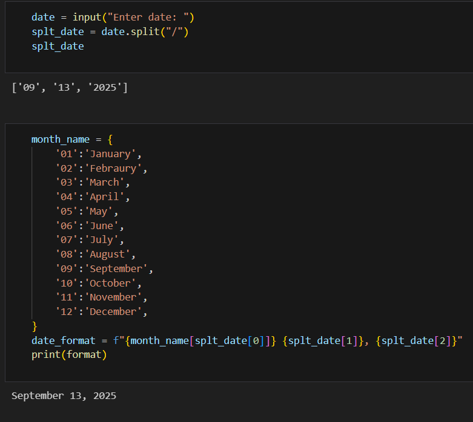

### Q7. Write a program with a function that accepts a string from keyboard and create a new string after converting character of each word capitalized. For instance, if the sentence is "stop and smell the roses." the output should be "Stop And Smell The Roses" 

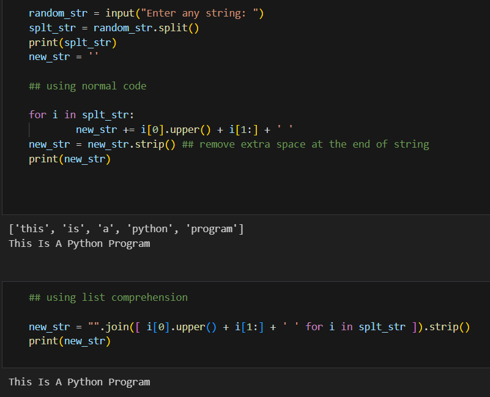

### Q8. Find the sum of each row of matrix of size m x n. For example for the following matrix output will be like this : 

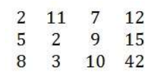

- Sum of row 1 = 32 
- Sum of row 2 = 31 
- Sum of row 3 = 63

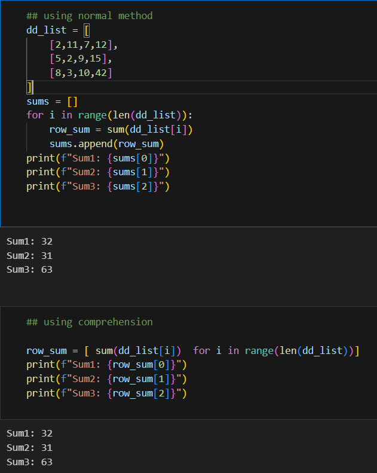

### Q9.  Write a program to add two matrices of size n x m.

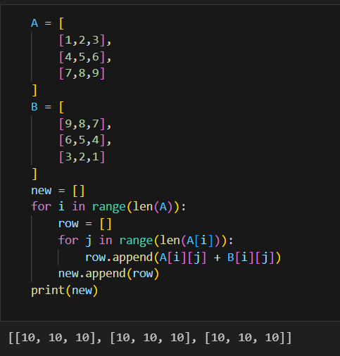

### Q10.  Write a program to multiply two matrices

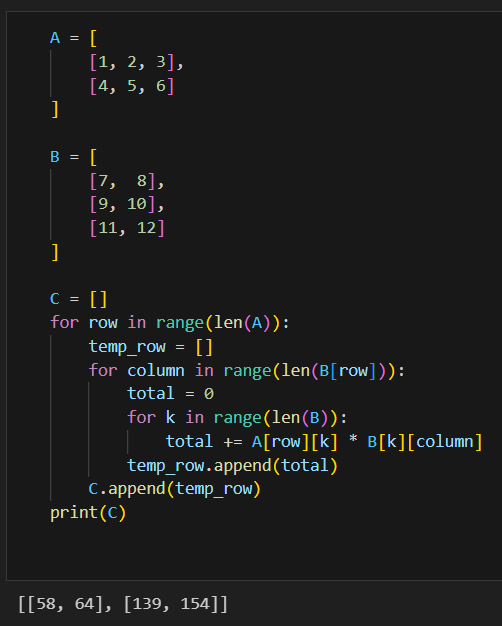
