## LOOPS ASSIGNMENT

### Q1. Write a Python program to print the numbers from 1 to 10 using a for loop.

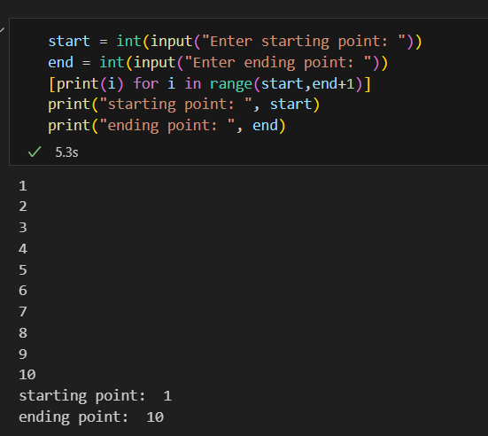

### Q2. Write a Python program to print the numbers from 20 to 1 using a while loop.

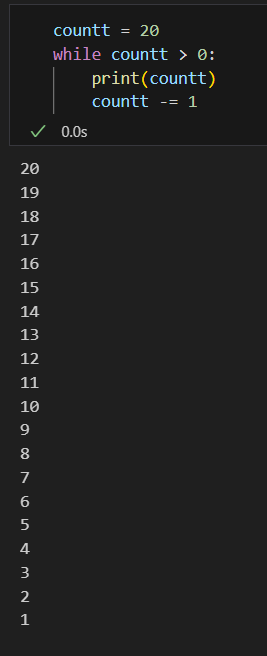

### Q3. Write a program to print even numbers from 1 to 10. 

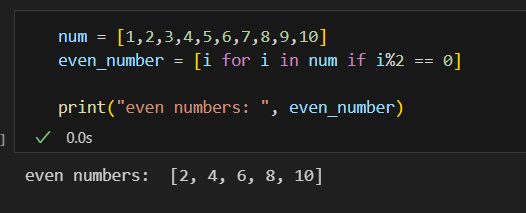

### Q4.  Write a program that prompts the user to enter a number n and prints all the numbers from 1 to n. 

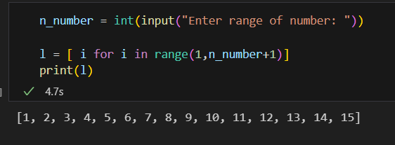

### Q5. Write a program that prompts the user to enter a number n, and then prints all the odd numbers between 1 and n. 

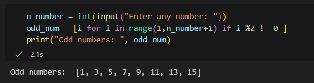

### Q6. Write a program that prints 'Happy Birthday!' five times on screen. 

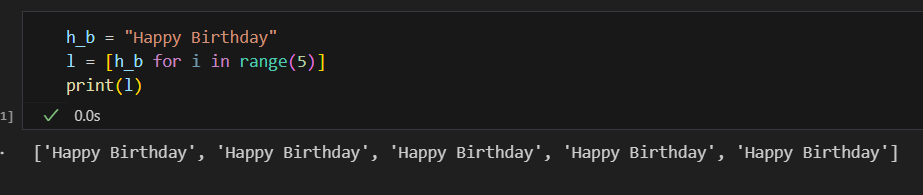

### Q7. Write a program that takes a number n as input from the user and generates the first n terms of the series formed by squaring the natural numbers.
- Sample output
- Enter a number: 6
- The first 6 terms of the series are:
- 1 4 9 16 25 36 

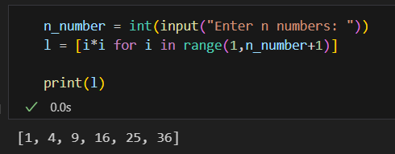

### Q8. Write a program that prompts the user to input a number and prints its multiplication table. 

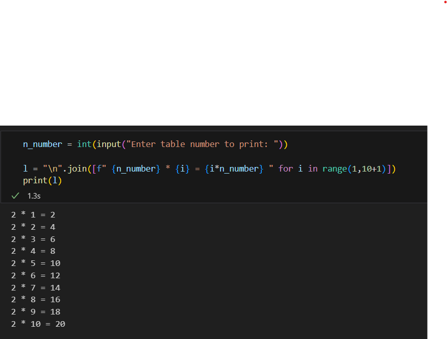

### Q9.  Write a Python program to print the first 8 terms of an arithmetic progression starting with 3 and having a common difference of 4. The program should output the following sequence: 3 7 11 15 19 23 27 31 

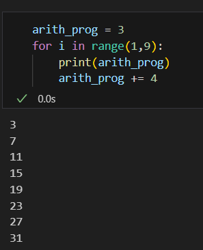

### Q10. Write a Python program to print the first 6 terms of a geometric sequence starting with 2 and having a common ratio of 3. The program should output the following sequence: 2 6 18 54 162 486

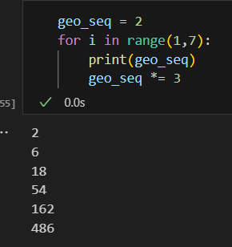

### Q11. Write a program that asks the user for a positive integer value. The program should calculate the sum of all the integers from 1 up to the number entered. For example, if the user enters 20, the loop will find the sum of 1, 2, 3, 4, ... 20. 

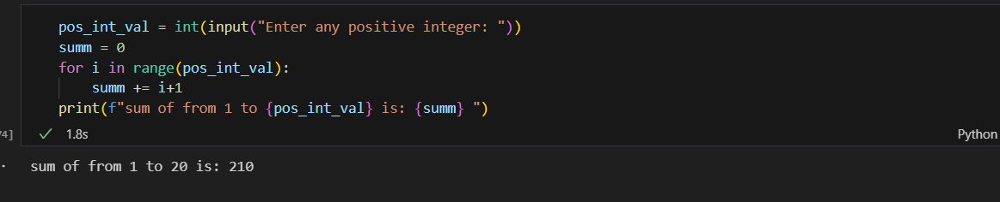

### Q12.  write a program that takes a positive integer N as input and calculates the sum of the reciprocals of all numbers from 1 up to N. The program should display the final sum.

- Output of the program should be like:
- Enter a positive integer: 5
- The sum of reciprocals from 1 to 5 is: 2.28

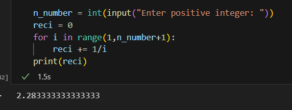

### Q13. Write a program that prompts the user to enter a number and repeats this process 5 times. The program should accumulate the numbers entered and then display the final running total.

- Sample Output:
- Enter a number: 10
- Enter a number: 15
- Enter a number: 35
- Enter a number: 40
- Enter a number: 50
- The final running total is: 150 

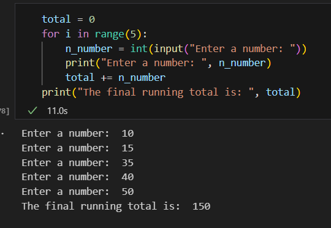

### Q14. Write a program that prompts the user to enter a positive integer and calculates its factorial. The factorial of a positive integer 'n' is denoted as 'n!' and is calculated by multiplying all the integers from 1 to 'n' together. For example, the factorial of 5 (denoted as 5!) is calculated as 1 x 2 x 3 x 4 x 5. 

### The program should display the factorial value if the input is a positive number, or display a message stating that the factorial does not exist for negative numbers. Additionally, for an input of zero, the program should output that the factorial of 0 is 1. 

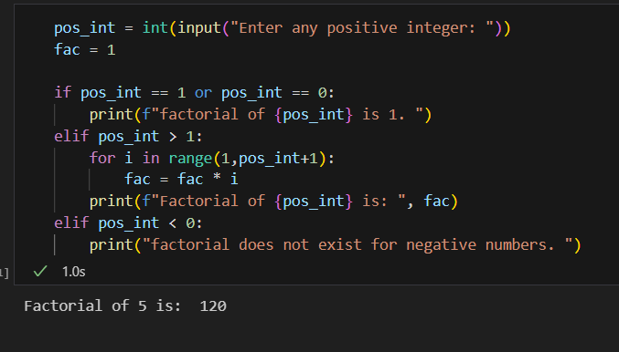

### Q15. Write a Python program that prompts the user to enter a base number and an exponent, and then calculates the power of the base to the exponent. The program should not use the exponentiation operator (**) or the math.pow() function. The program should handle both positive and negative exponents.  

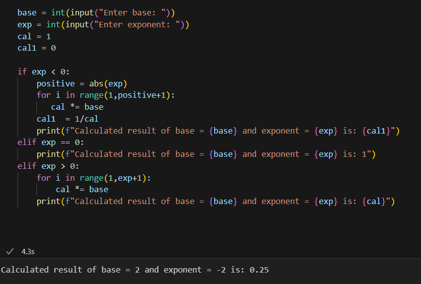

