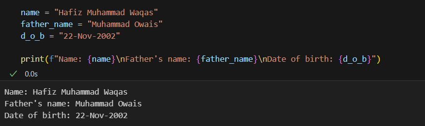
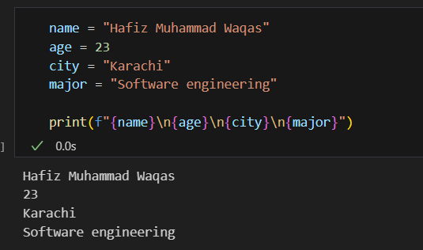
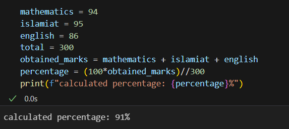

## PYTHON BASICS ASSIGNEMNT

### Q1. Print Your Name with your Father name and Date of birth using suitable escape sequence charactor

### Q2. Write your small bio using variables and print it using print function

### Q3. Write a program in which use all the operators we can use in Python

.png)

.png)

### Q4. Completes the following steps of small task:

- Mention Marks of English , Islamiat and Maths out of 100 in 3 different variables
- Mention Variable of Total Marks and assign 300 to it
- Calculate Percentage

