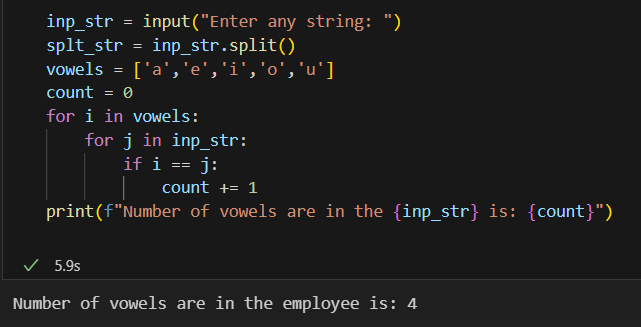
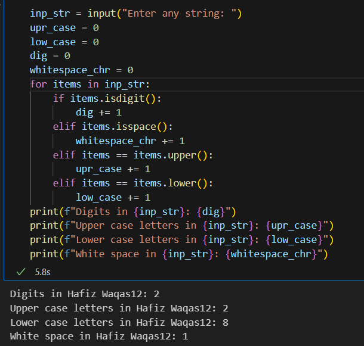
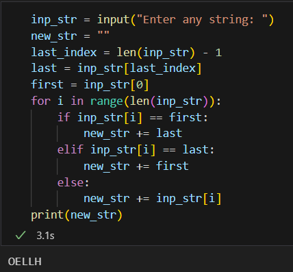
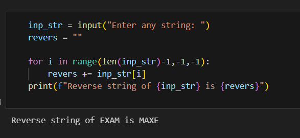
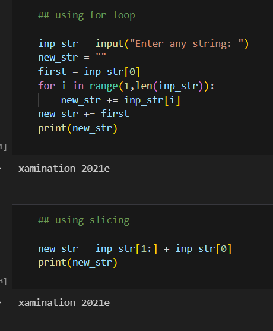
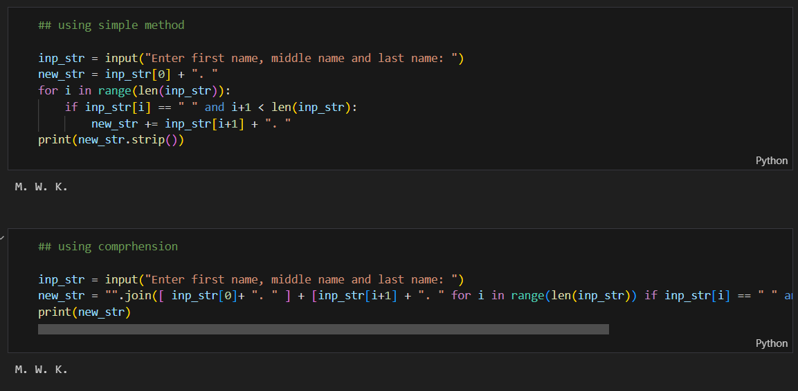
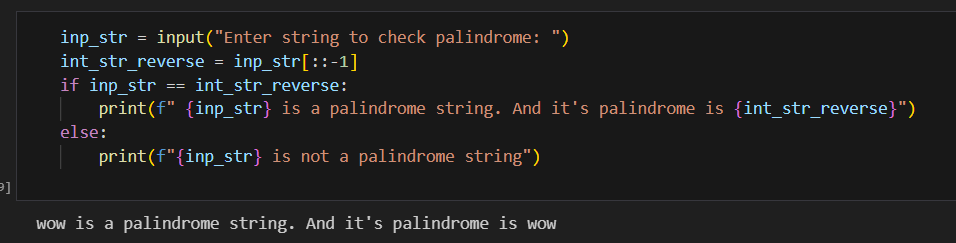
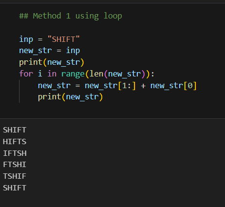
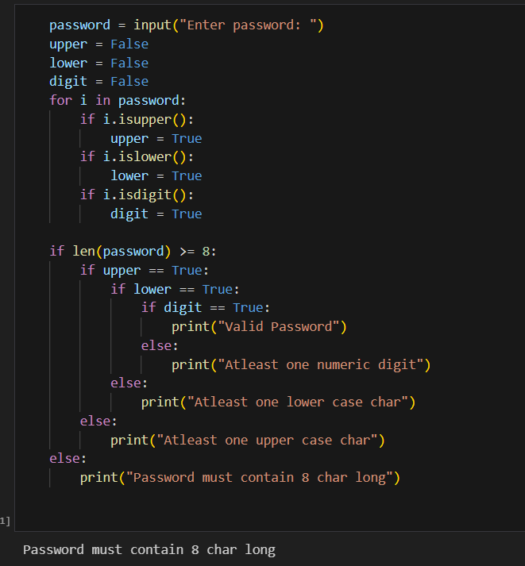

## STRING ASSIGNMENT

### Q1. Write a program that accepts a string from user. Your program should count and display number of vowels in that string. 

### Q2. Write a program that reads a string from keyboard and display: 
- The number of uppercase letters in the string 
- The number of lowercase letters in the string 
- The number of digits in the string 
- The number of whitespace characters in the string 

### Q3.  Write a Python program that accepts a string from user. Your program should create and display a new string where the first and last characters have been exchanged. 

- For example if the user enters the string 'HELLO' then new string would be 'OELLH' 

### Q4. Write a Python program that accepts a string from user. Your program should create a new string in reverse of first string and display it.

- For example if the user enters the string 'EXAM' then new string would be 'MAXE'  

### Q5.  Write a Python program that accepts a string from user. Your program should create a new string by shifting one position to left. 

- For example if the user enters the string 'examination 2021' then new string would be 'xamination 
2021e'

### Q6. Write a program that asks the user to input his name and print its initials. Assuming that the user always types first name, middle name and last name and does not include any unnecessary spaces. 

- For example, if the user enters Ajay Kumar Garg the program should display A. K. G. 
Note:Don't use split() method 

### Q7.  A palindrome is a string that reads the same backward as forward. For example, the words dad, madam and radar are all palindromes. Write a programs that determines whether the string is a palindrome. Note: do not use reverse() method  

### Q8.  Write a program that display following output: 
- SHIFT 
- HIFTS 
- IFTSH 
- FTSHI 
- TSHIF 
- SHIFT  

### Q9. Write a program in python that accepts a string to setup a passwords. Your entered password must meet the following requirements: 

- The password must be at least eight characters long. 
- It must contain at least one uppercase letter. 
- It must contain at least one lowercase letter. 
- It must contain at least one numeric digit. 
- Your program should should perform this validation.

