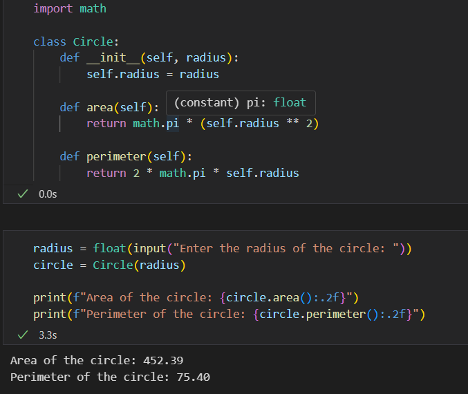
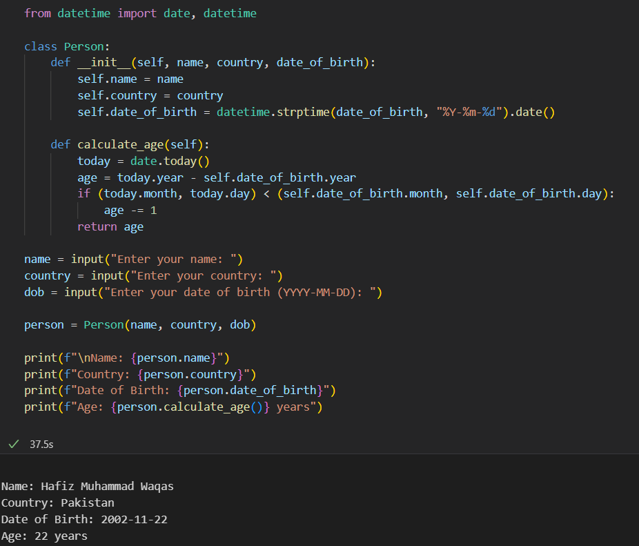
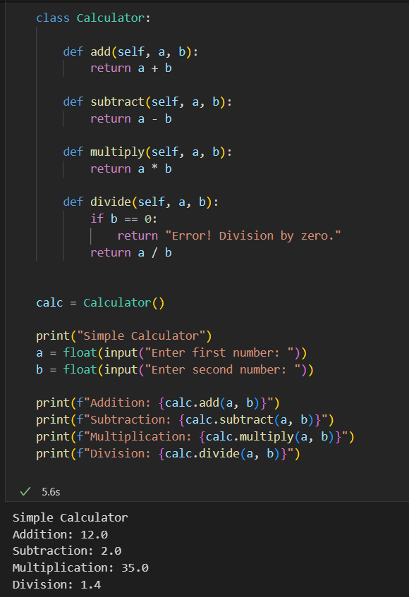

## CLASSES ASSIGNMENT

**Q1. Write a Python program to create a class representing a Circle. Include methods to calculate its area and perimeter.** 

### OUTPUT

**Q2. Write a Python program to create a person class. Include attributes like name, country and date of birth. Implement a method to determine the person's age.**

### OUTPUT

**Q3. Write a Python program to create a calculator class. Include methods for basic arithmetic operations.**

### OUTPUT

