# PYTHON QUIZ SCENARIO BASED QUESTIONS

## Scenarion 1
- File Processing and Exceptional Handling

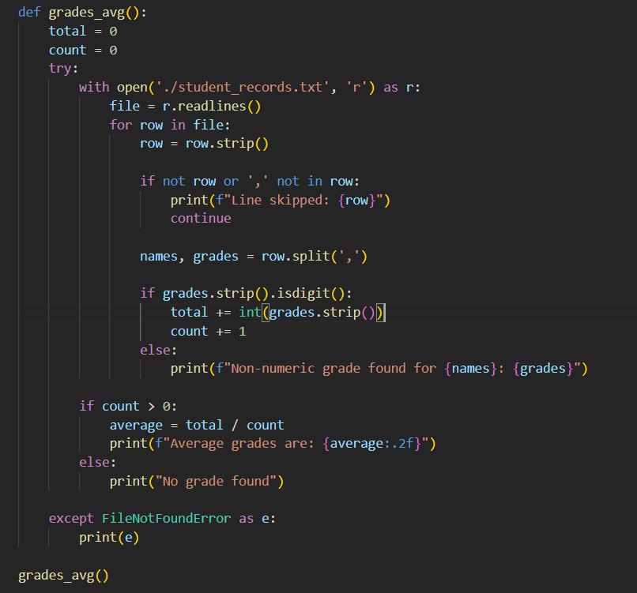

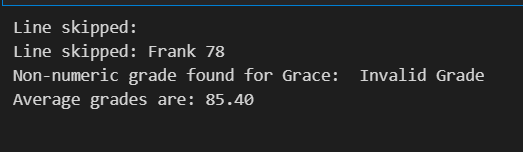

## Scenario 2

- Object-Oriented Programming and Inheritance

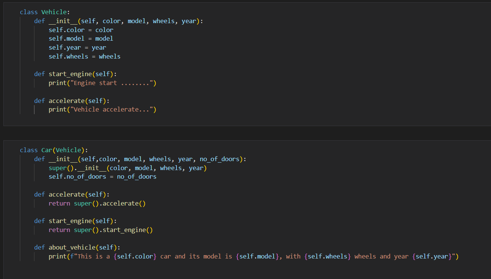

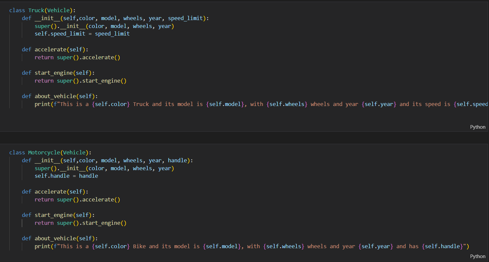

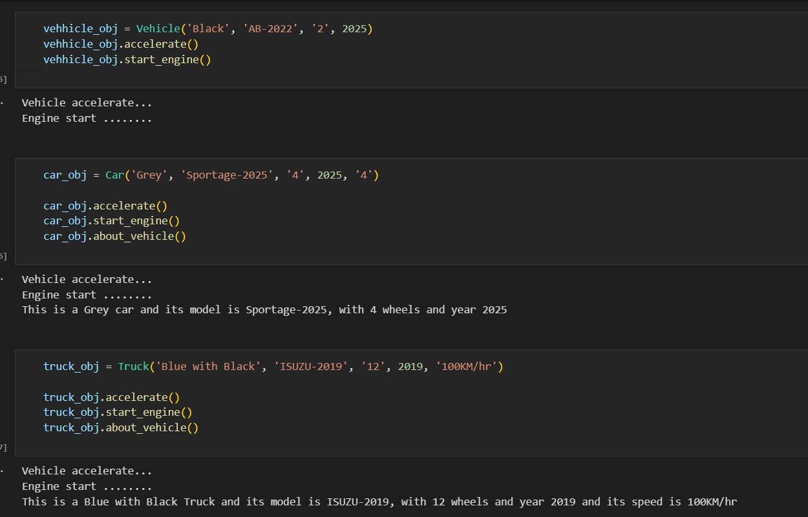

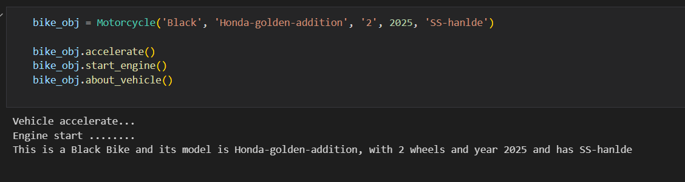

## Scenario 3

- Functions and Modules (Library management system)

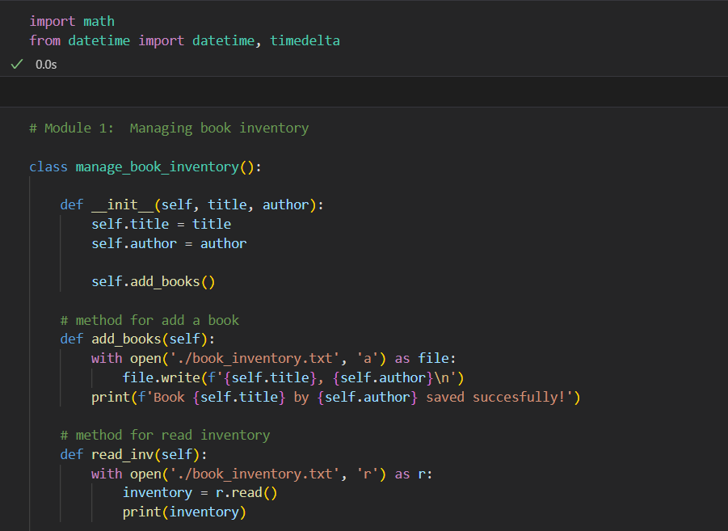

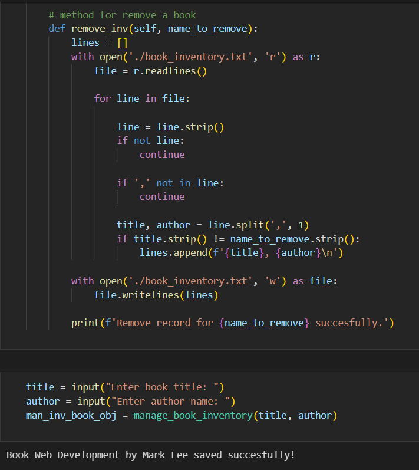

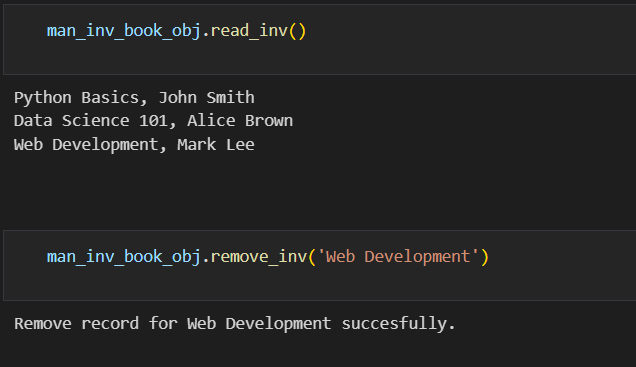

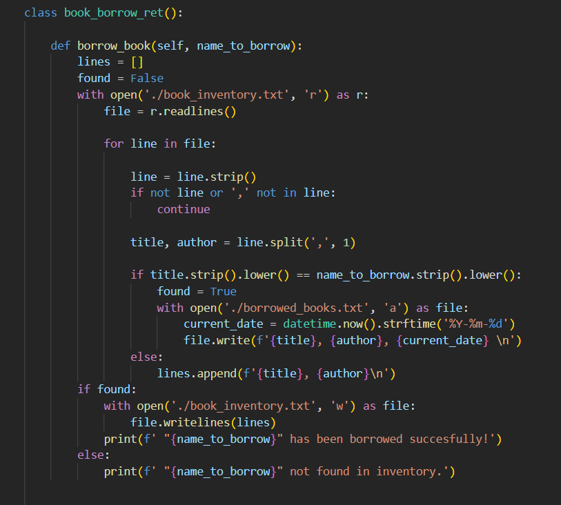

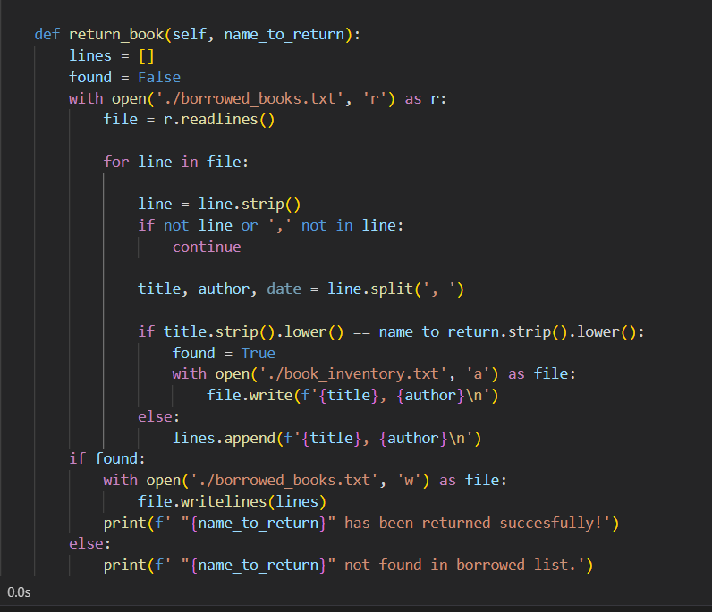

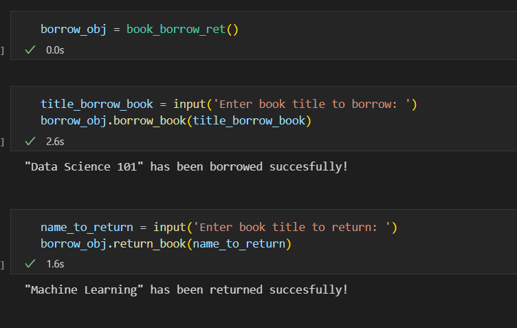

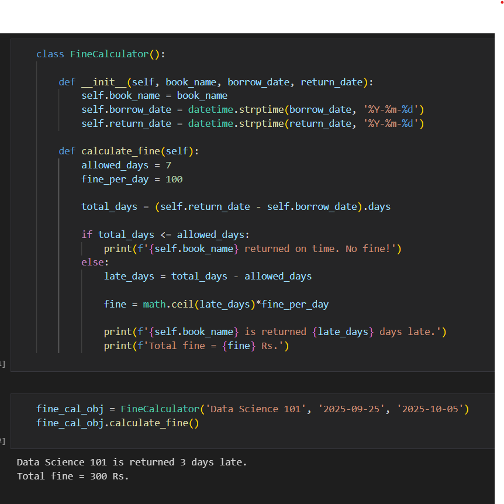

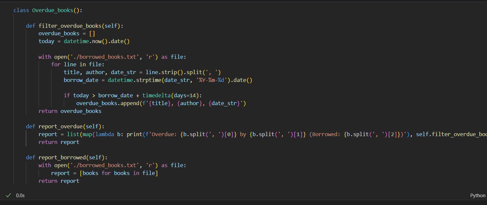

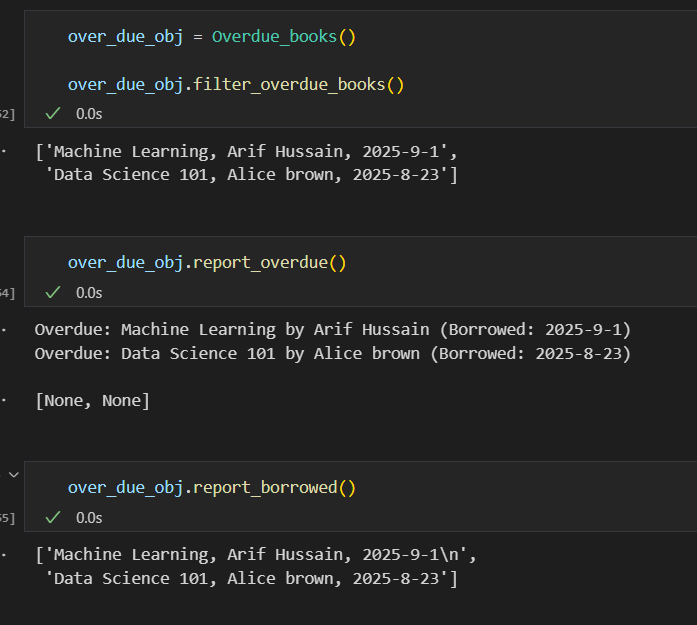

## Scenario 4

- Debugging Code

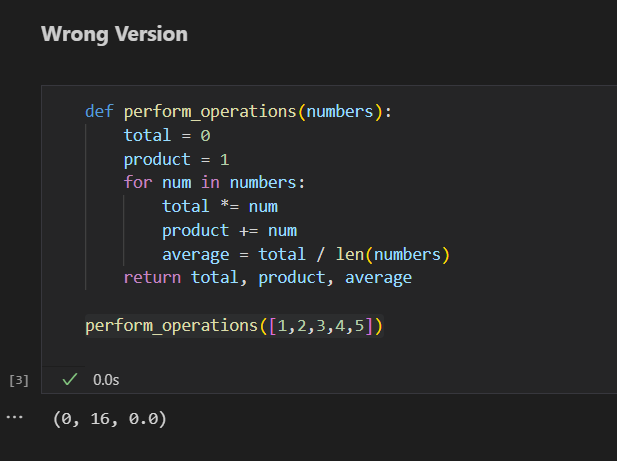

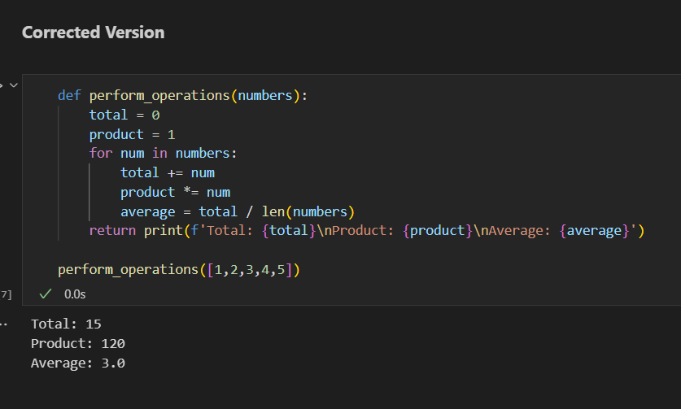
