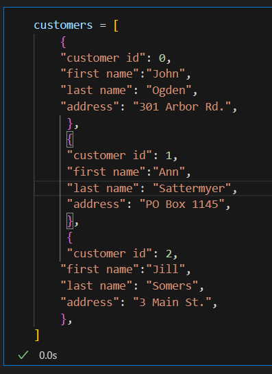
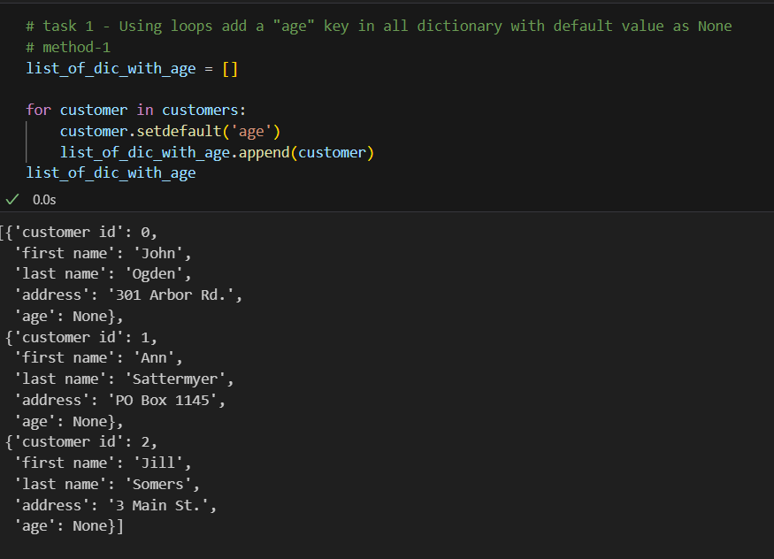
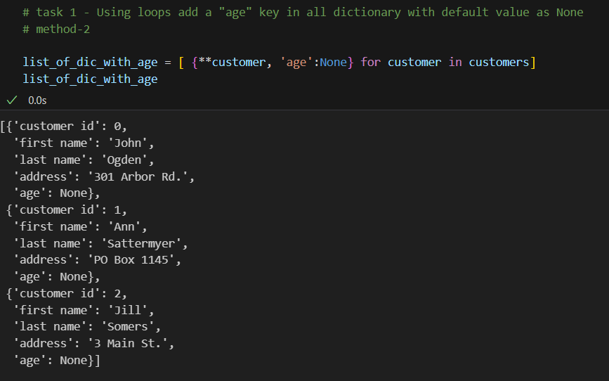
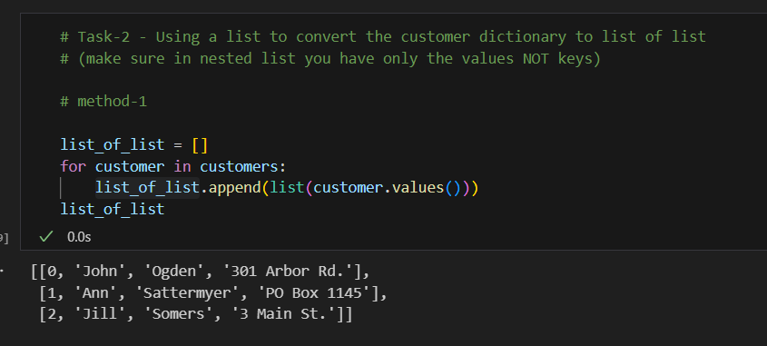
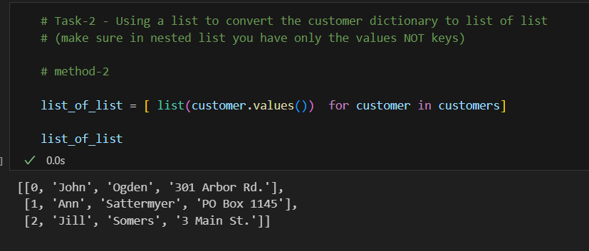
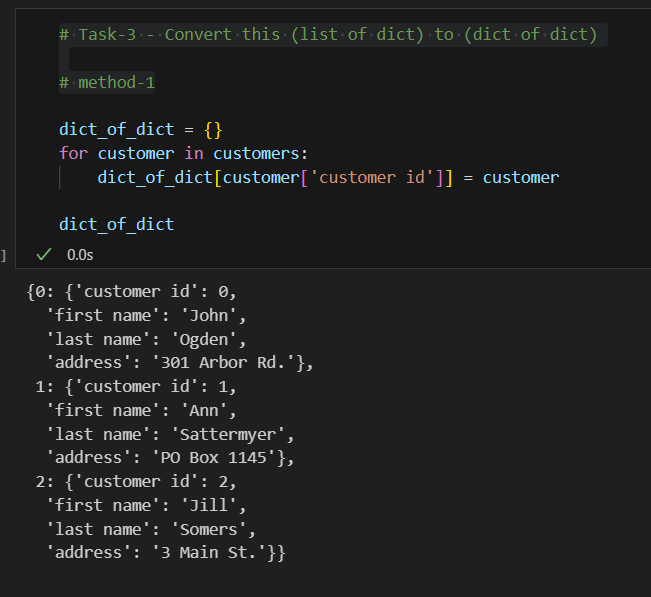
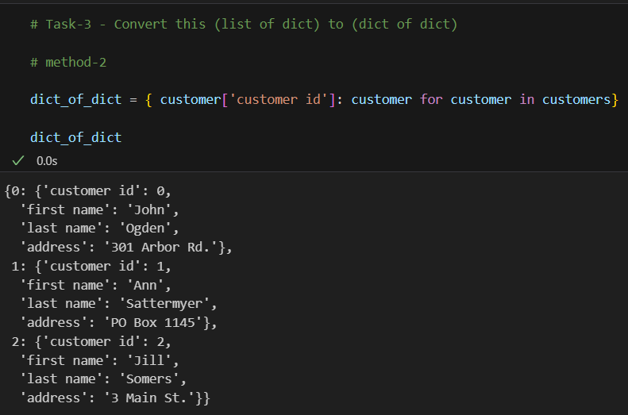
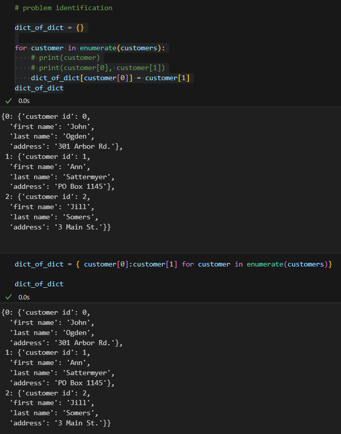
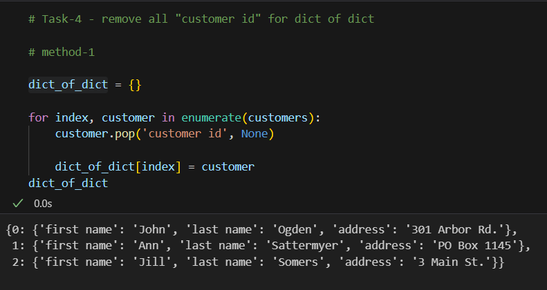
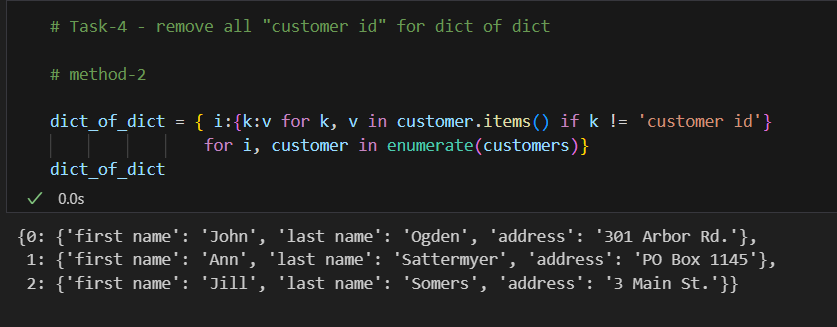

## TASK

### Complete all task using comprehension

#### Task-1

- Using loops add a "age" key in all dictionary with default value as None

#### Task-2

- Using a list to convert the customer dictionary to list of list (make sure in nested list you have only the values NOT keys)

#### Task-3

- Convert this (list of dict) to (dict of dict)

#### Problem Identification

#### Task-4

- remove all "customer id" for dict of dict

