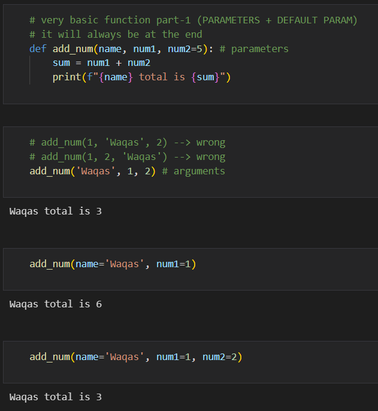

### Functions

#### Basic Functions

#### Very basic function part-1 (PARAMETERS + DEFAULT PARAM) 

- DEFAULT PARAM --> it will always be at the end

#### Very basic function part-1(unknows)

- unknows --> it will always be at the end

- **--> dict

- *--> list

### While loop

- Task: Research about while loop syntax and write a code of finding factorial using while loop.

### Classes

- Everything belong to some specific **class**
- Every class can have its **object**
- Every class can have its owns **methods**

- Task: create a class of humans that have atleast 2 attributes and methods

