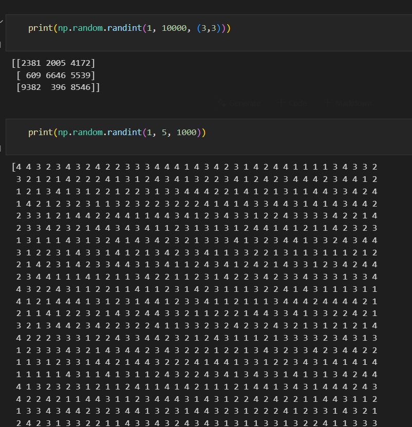

## 1. NUMPY

- ## Subsetting/Slicing 

- ## 2D Array

- ## 2. Data Visualization (MATPLOTLIB)

- Very important in Data analysis
- Explore data
- Report insights
- `Source: GapMinder, Wealth and Health of Nation`

