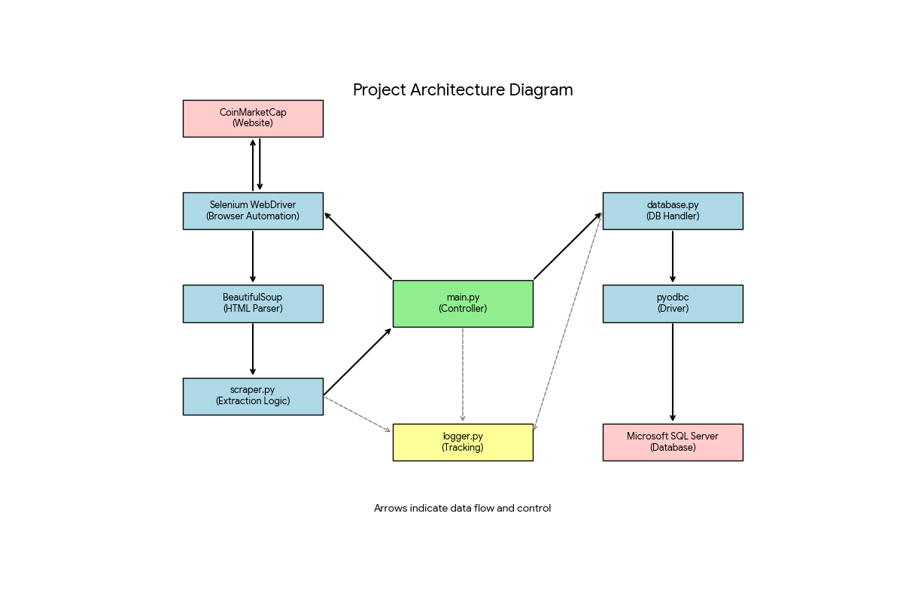

# 🪙 CoinMarketCap Live Data Scraper

## Overview
This is a robust web scraping automation tool built with **Python**, **Selenium**, and **BeautifulSoup**. It scrapes live cryptocurrency data (Rank, Price, Market Cap, Volume, Supply, etc.) from [CoinMarketCap](https://coinmarketcap.com) and stores it directly into **Microsoft SQL Server**.

The project is designed with a **Modular Architecture**, ensuring separation of concerns between scraping logic, database management, and execution flow. It handles dynamic content loading using **Smart Scrolling** and includes a comprehensive **Logging System**.

## Project Architecture Diagram



## 🚀 Key Features
* **Hybrid Scraping:** Uses **Selenium** for handling JavaScript/Lazy Loading and **BeautifulSoup** for fast HTML parsing.
* **Smart Scrolling:** Automatically scrolls through the page to trigger data loading before scraping.
* **SQL Server Integration:** Connects securely to MS SQL Server using `pyodbc` and Windows Authentication.
* **Resilient Logic:** Handles pagination (90+ pages) and network timeouts gracefully.
* **Automated Database Setup:** Automatically creates the Database and Table if they don't exist.
* **Logging:** detailed tracking of every step in `logs/scraping.log`.

## 🛠️ Tech Stack
* **Language:** Python 3.x
* **Browser Automation:** Selenium WebDriver
* **Parsing:** BeautifulSoup4
* **Database:** Microsoft SQL Server (T-SQL)
* **DB Driver:** pyodbc
* **Logger:** Python standard logging

## 📂 Project Structure
```text
├── config.py          # Configuration (URL, SQL Server Credentials, Settings)
├── database.py        # Handles SQL Server connections, Table creation, and Insertion
├── logger.py          # Centralized logging configuration
├── main.py            # Entry point (Orchestrates the scraping process)
├── scraper.py         # Selenium & BeautifulSoup logic (Scrolling & Parsing)
├── requirements.txt   # List of dependencies
├── README.md          # Documentation
└── logs/              # Folder where runtime logs are stored