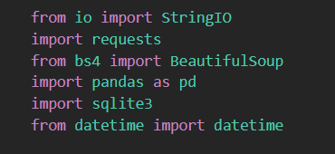
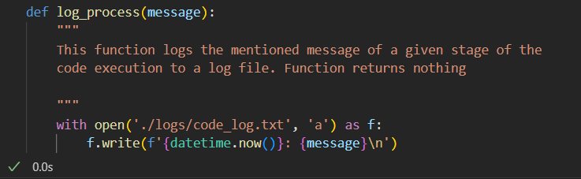
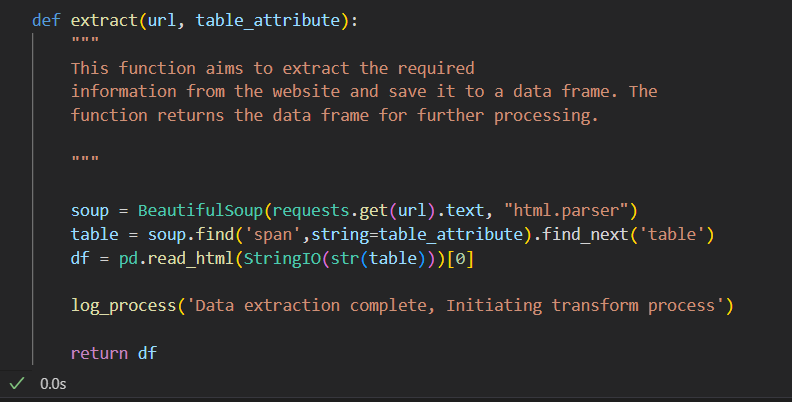
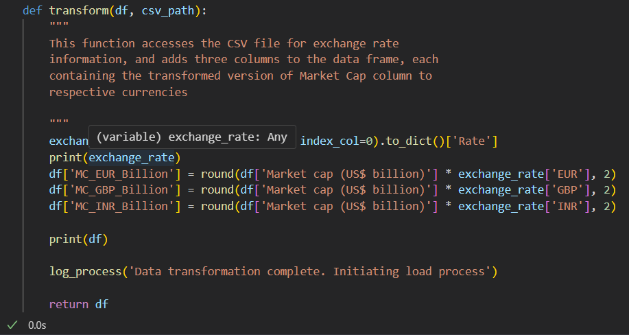
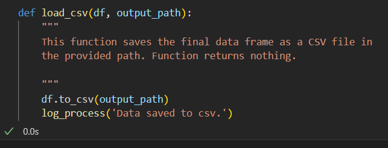
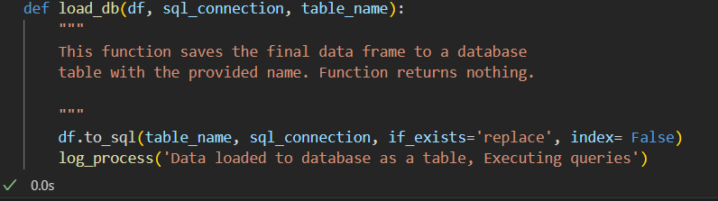
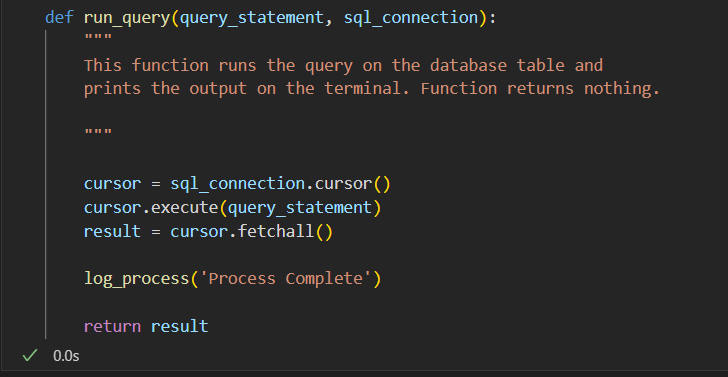
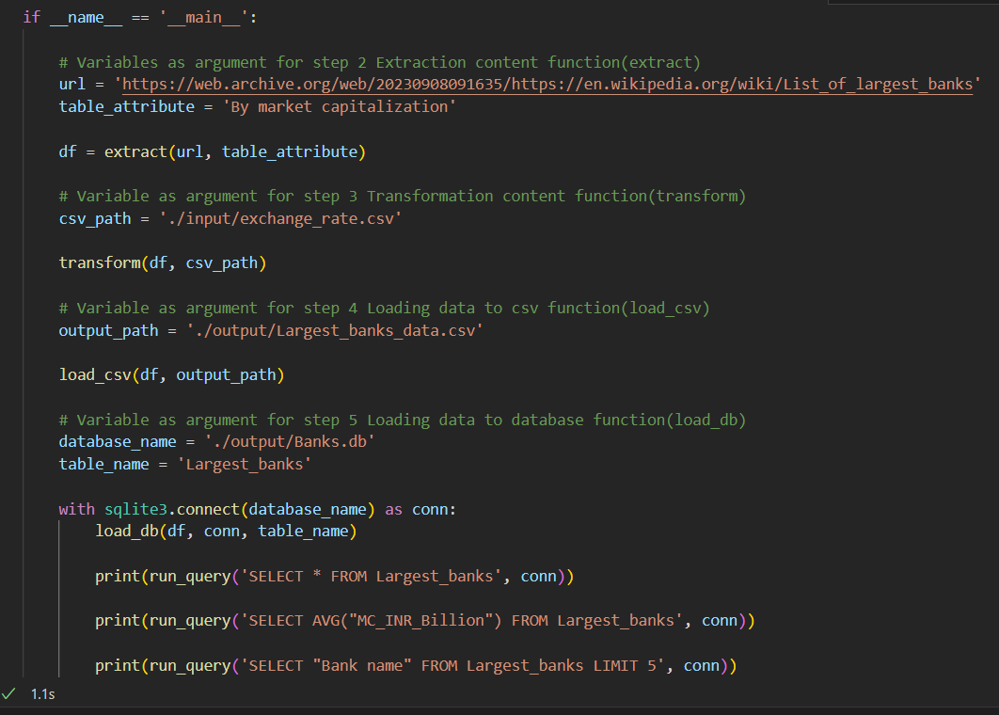
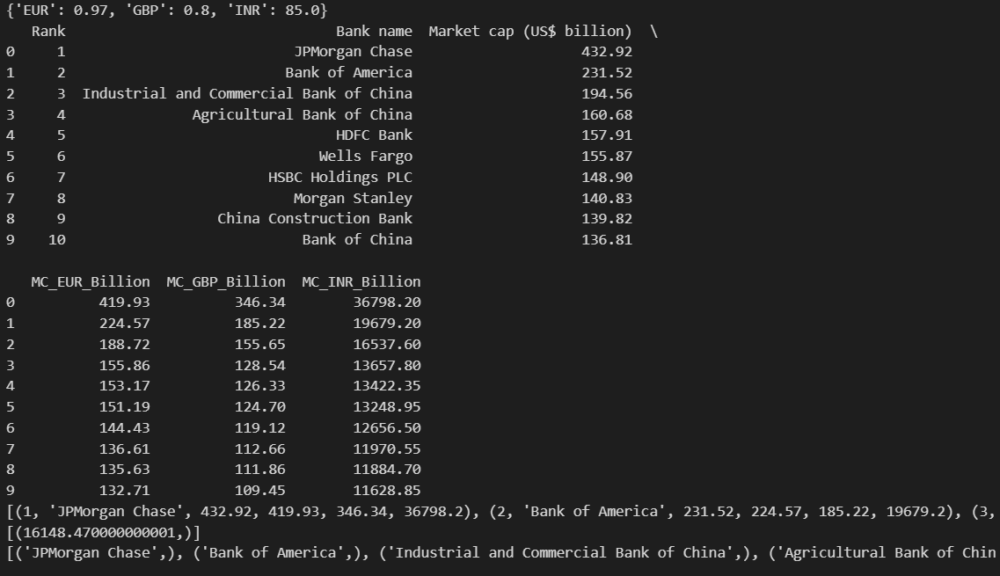

## **CLOUD DATA ENGINEERING FIRST PROJECT**

### **Basic extract, transform, and load (ETL) pipeline using web scraping, pandas and sql.**

#### Import necessary libraries

### Step:1 Maintaining a Log File

This step is done to record the logs while performing ETL and it is not necessary in an ETL pipeline.

### Step 2:  Extract

### Step 3: Transformation

### Step 4: Load

Loading data to csv

### Step 5: Load 

Loading data to SQL

### Run Queries

### Executing Pipeline

### OUTPUT AFTER EXECUTING PIPELINE

